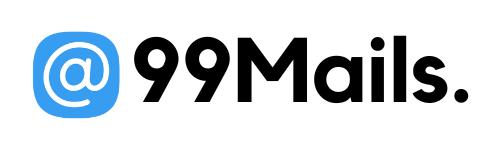

  
  <h1>99 Mails.</h1>
    

      <b>A User friendly, 🔒 Safe and ⏰ available temporary ✉️ email service.
      </b>
    

## What is it?

<b>Disposable email</b> - is a free email service that allows to receive email at a temporary address that self-destructed after a certain time elapses. It is also known by names like : tempmail, 10minutemail, 10minmail, throwaway email, fake-mail , fake email generator, burner mail or trash-mail. Many forums, Wi-Fi owners, websites and blogs ask visitors to register before they can view content, post comments or download something. Temp-Mail - is most advanced throwaway email service that helps you avoid spam and stay safe.

## Why?

Forget about 📩 spams, 📯 advertising mailings, 😈 hacking and 🤖 attacking robots. Keep your real mailbox clean and secure. 99 Mails provides temporary, secure, anonymous, free, disposable 📮 email address.

## Features

| Feature                                                         |     |
| --------------------------------------------------------------- | --- |
| 15+ different email name servers                                | ✅  |
| No need for subscription, authentication and login              | ✅  |
| Restore access with custom dashboard                            | ✅  |
| No email is saved on servers                                    | ✅  |
| 10 minutes life of emails with extendable times                 | ✅  |
| Download your emails as Zip or save to Google Drive and Dropbox | ✅  |

## Getting Started

TODO

## Roadmap

See the [open issues](https://github.com/jihchi/dify/issues) for a list of proposed features (and known issues).

## Contributing

Contributions are what make the open source community such an amazing place to be learn, inspire, and create. Any contributions you make are **greatly appreciated**.

1. Fork the Project
2. Create your Feature Branch (`git checkout -b feature/AmazingFeature`)
3. Commit your Changes (`git commit -m 'Add some AmazingFeature'`)
4. Push to the Branch (`git push origin feature/AmazingFeature`)
5. Open a Pull Request

## License

Distributed under the MIT License. See [`LICENSE`](./LICENSE.md) for more information.

## Contributors

Many thanks for your help!

The image of contributors is made with [contrib.rocks](https://contrib.rocks).
